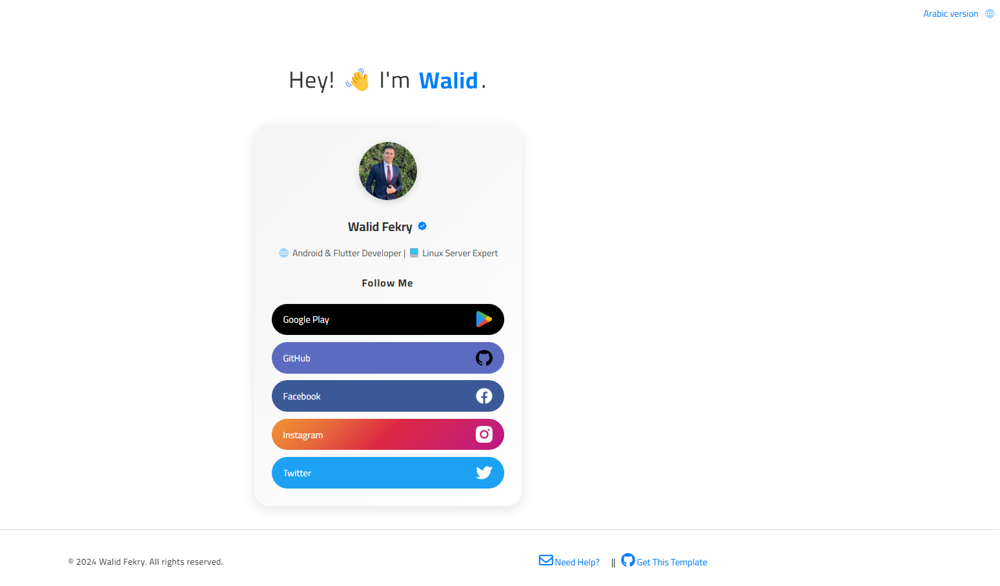
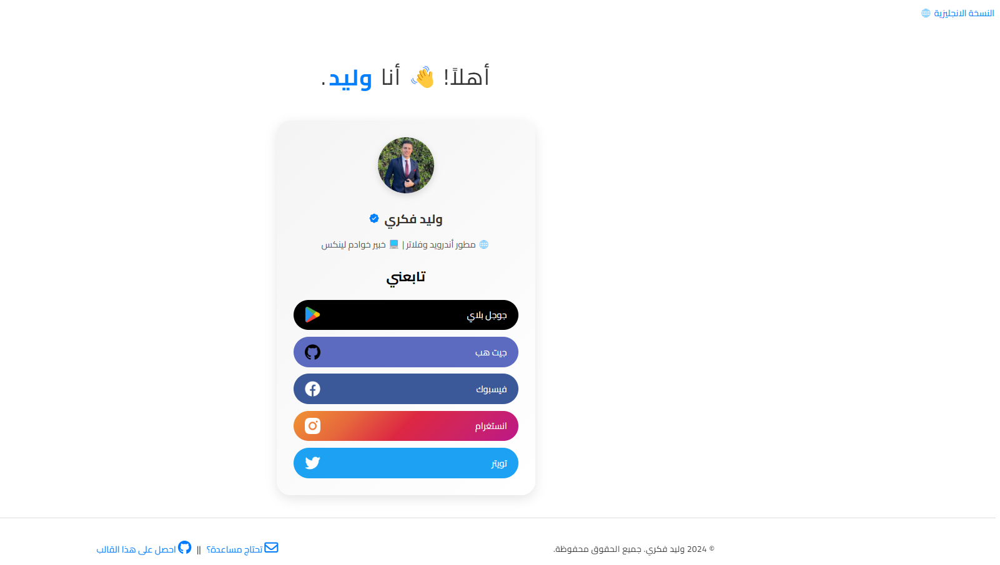

# 🚀 Personal Profile Page

This is a clean and simple profile page template featuring a photo, name, and links to various social media accounts (Facebook, Instagram, Twitter, Google Play, GitHub).

## 🛠 Features:
- Supports Arabic version
- Minimal and responsive design
- Includes social media icons and links
- Easy to customize for personal use

  
## 📱 Screenshot Of English Version
<td style="text-align: center;">
    
</td>

## 📱 Screenshot Of Arabic Version
<td style="text-align: center;">
    
</td>

## ☢️ How to use:
1. Clone this repository.
2. Use a text editor or IDE (like Visual Studio Code, Sublime Text, or Notepad++).
3. Open `index.html` and `stay-connected.html`
4. Customize the content and links as needed.

🚨 Feel free to use this template as a starting point for your own personal or professional profile.
